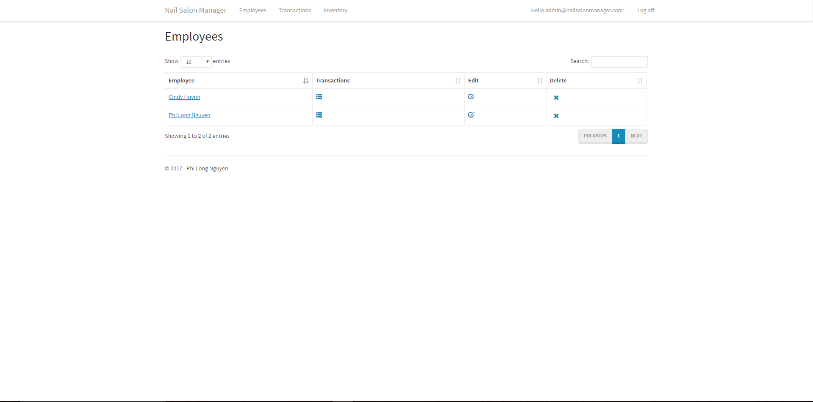

# Nail Salon Manager
Nail Salon Manager is an application for Nail Salons' owners to keep track of the shop's earnings as well as for employees to keep track of their individual earnings.

This application is intended for me to practice developing in C#'s ASP.NET MVC.

## Resource
To make this application I took a course by Mosh Hamedani on Udemy to learn the basics of ASP.NET MVC.

Link: https://www.udemy.com/the-complete-aspnet-mvc-5-course/

I used the concepts learned through the course to develop this application.

## Usage
Simply clone this repository and open using Visual Studio. From there you can either publish the application or further develop it.

## Demo and Features

This is the homepage of the application, from here the user can either log in or register. How this application is set up, the employer is hard coded into the system. Everytime a user register, the employer gains a new employee.

This is the register view.

This is the log in view.

This is what it looks like when the employee successfully registers, logs into the application, and added a couple transactions. The employee can only view his transactions and not someone else's. The employee can also sort the transactions according to each columns and also search for specific transactions.

When the employer logs in he can see the transactions of his entire shop. Every transactions from every employee under the employer will be listed.

Here the employer can see his list of employees, of which the employer can edit or delete at will. Clicking on the employee's name will shows the employee's details such as address and DOB. Clicking on the button under Transactions will bring up a table that shows that employee specific transactions.

Here is the view for the inventory list where the employer can add/view his shop's list of inventory items. The employer can freely add/delete each item.

